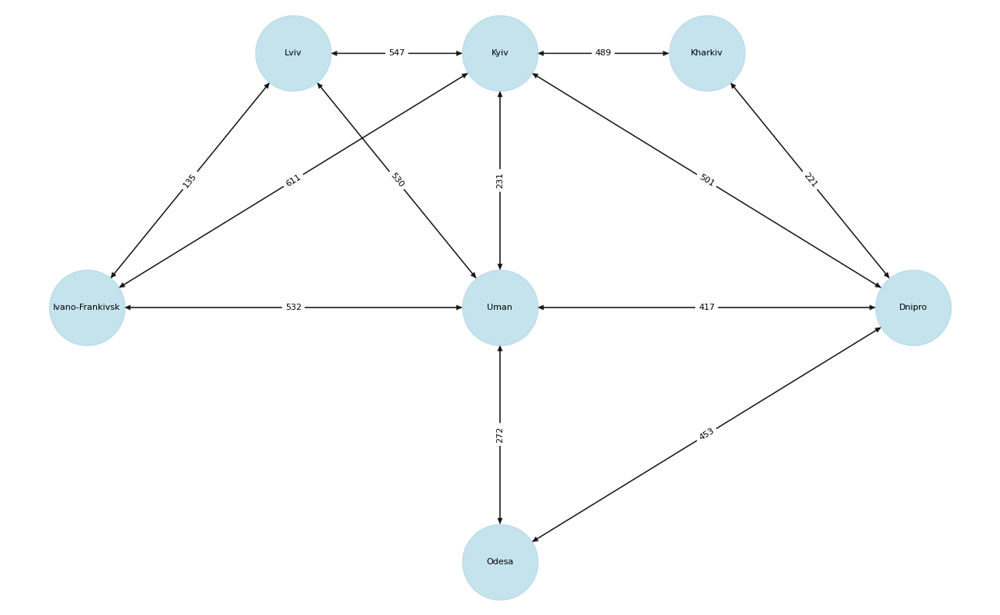

## Завдання 1: Моделювання транспортної мережі

Створено граф транспортної мережі українських міст з використанням бібліотеки NetworkX.

### Характеристики графа:
- **Кількість вершин**: 7 міст (Київ, Харків, Дніпро, Одеса, Умань, Львів, Івано-Франківськ)
- **Кількість ребер**: 24 (12 двонаправлених з'єднань)
- **Ваги ребер**: відстані між містами в кілометрах з Google Maps

### Аналіз центральності:
- **Найбільш центральні міста**: Умань та Київ (degree centrality = 1.667)
- **Найменш центральні**: Одеса та Харків (degree centrality = 0.667)
- **Транзитні вузли**: Умань та Київ мають найвищу betweenness centrality (0.233), що робить їх ключовими транзитними точками

```
Number of nodes: 7
Number of edges: 24

Degreee centrality:
Uman: 1.667
Kyiv: 1.667
Dnipro: 1.333
Lviv: 1.000
Ivano-Frankivsk: 1.000
Odesa: 0.667
Kharkiv: 0.667

Closeness centrality:
Uman: 0.857
Kyiv: 0.857
Dnipro: 0.750
Lviv: 0.667
Ivano-Frankivsk: 0.667
Odesa: 0.600
Kharkiv: 0.600

Betweenness centrality:
Uman: 0.233
Kyiv: 0.233
Dnipro: 0.133
Odesa: 0.000
Lviv: 0.000
Kharkiv: 0.000
Ivano-Frankivsk: 0.000
```



## Завдання 2: Порівняння алгоритмів DFS та BFS

Реалізовано алгоритми пошуку в глибину (DFS) та пошуку в ширину (BFS) для обходу графа.

### Результати обходу від міста Харків:

BFS (пошук в ширину):
```
['Kharkiv', 'Dnipro', 'Kyiv', 'Uman', 'Odesa', 'Lviv', 'Ivano-Frankivsk']
```

DFS (пошук в глибину):
```
['Kharkiv', 'Dnipro', 'Uman', 'Kyiv', 'Lviv', 'Ivano-Frankivsk', 'Odesa']
```

### Пояснення різниці:

BFS досліджує граф рівнями:
- Спочатку всі сусіди на відстані 1 від старту (Дніпро, Київ)
- Потім всі сусіди на відстані 2 (Умань, Одеса, Львів)
- Останній на відстані 3: Івано-Франківськ

DFS йде максимально глибоко по одній гілці:
- Слідує шляхом: Харків, Дніпро, Умань, Київ, Львів, Івано-Франківськ
- Одеса відвідується останньою під час повернення назад до Умані

Відмінність BFS знаходить вершини у порядку зростання відстані від стартової точки, тоді як DFS досліджує найглибші вершини першими, незалежно від відстані.

## Завдання 3: Алгоритм Дейкстри

Реалізовано алгоритм Дейкстри для знаходження найкоротших шляхів у зважених графах.

```
Distances from Kharkiv:
    to Kharkiv: 0 km
    to Dnipro: 221 km
    to Kyiv: 489 km
    to Uman: 638 km
    to Odesa: 674 km
    to Lviv: 1036 km
    to Ivano-Frankivsk: 1100 km

Distances from Lviv:
    to Lviv: 0 km
    to Ivano-Frankivsk: 135 km
    to Uman: 530 km
    to Kyiv: 547 km
    to Odesa: 802 km
    to Dnipro: 947 km
    to Kharkiv: 1036 km

Distances from Odesa:
    to Odesa: 0 km
    to Uman: 272 km
    to Dnipro: 453 km
    to Kyiv: 503 km
    to Kharkiv: 674 km
    to Lviv: 802 km
    to Ivano-Frankivsk: 804 km
```

### Висновки:

- Алгоритм Дейкстри успішно знаходить оптимальні маршрути, враховуючи ваги ребер
- Алгоритм Дейкстри видає доволі стабільні результати, що перевірено результами з кінцевих пунктів
